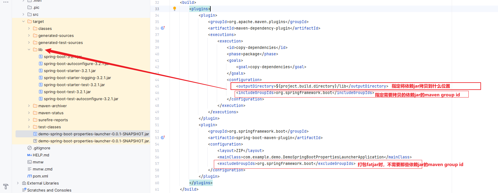

### maven package设置

- layout设置
```pom
<layout>ZIP</layout>
```
- 需要放在外部的jar设置


### 启动设置
- spring boot fatjar正常启动时：
```
java -jar demo-spring-boot-properties-launcher-0.0.1-SNAPSHOT.jar
```
- spring boot fatjar中不包含部分依赖jar, 并将依赖jar存放在当前目录下lib文件夹中
```
java -Dloader.path=./lib -jar demo-spring-boot-properties-launcher-0.0.1-SNAPSHOT.jar
```


